# emart-app
## 🖼️ Project Screenshots

Here are some visuals of the deployed eMartApp project:

### 🔹 Home Page
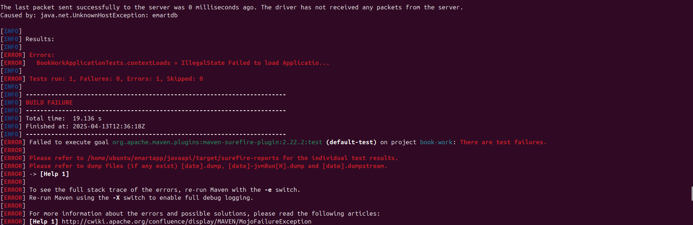

### 🔹 Product Listing
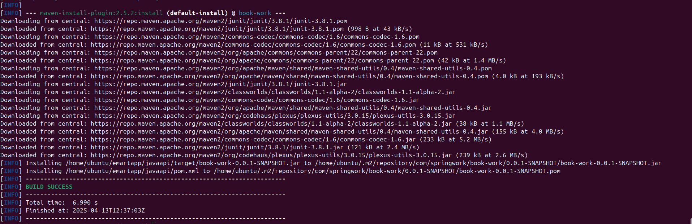

### 🔹 Product Details
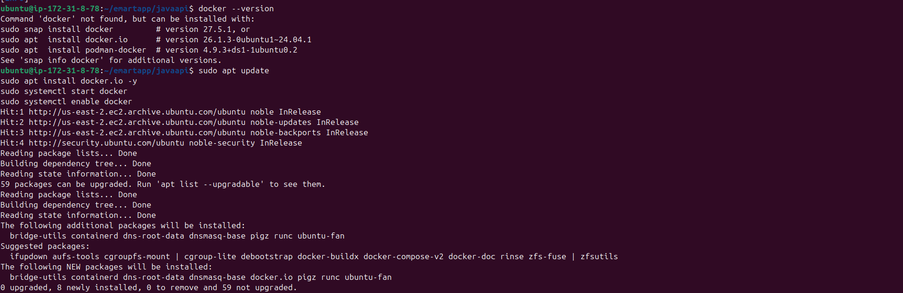

### 🔹 Cart View
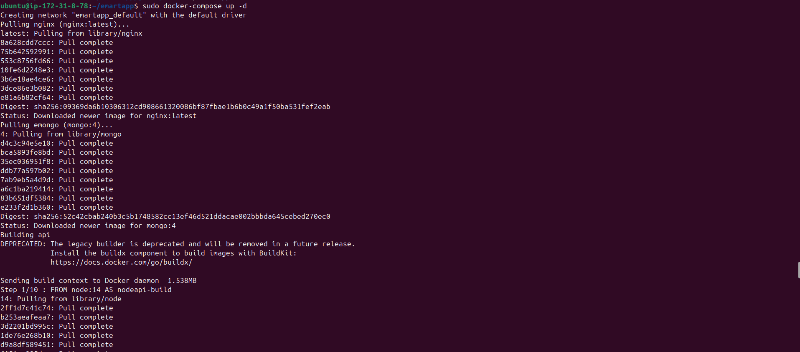

### 🔹 Checkout Flow
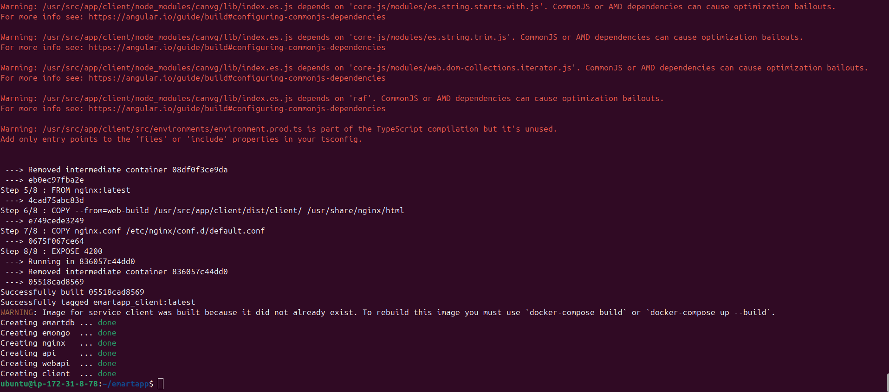

### 🔹 Admin Dashboard
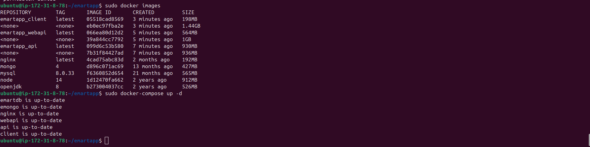

### 🔹 Terminal / CI-CD Logs
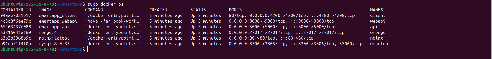

### 🔹 Nginx Reverse Proxy
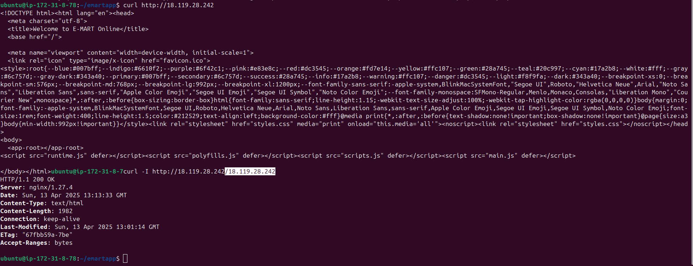

### 🔹 Docker Containers Running
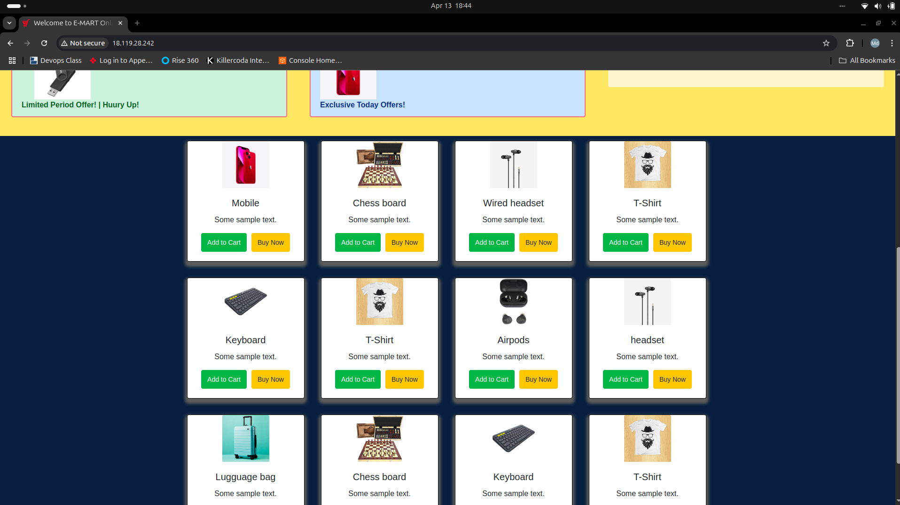

### 🔹 EC2 Deployment Confirmation
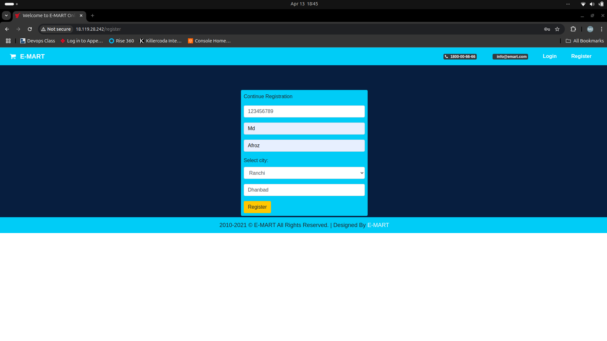

### 🔹 Full Stack Running
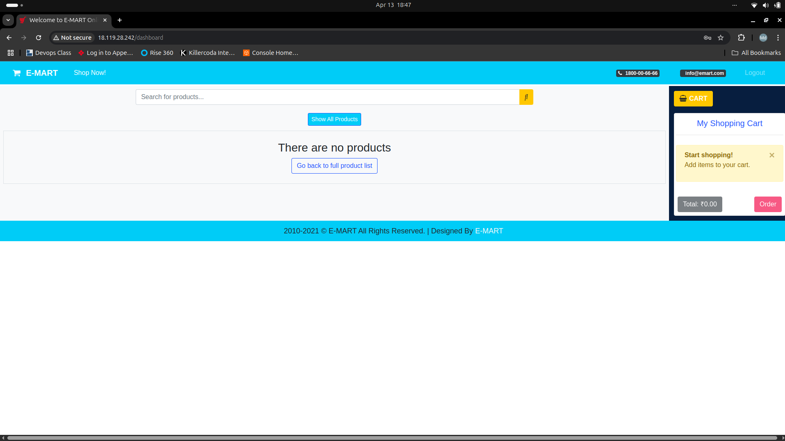
